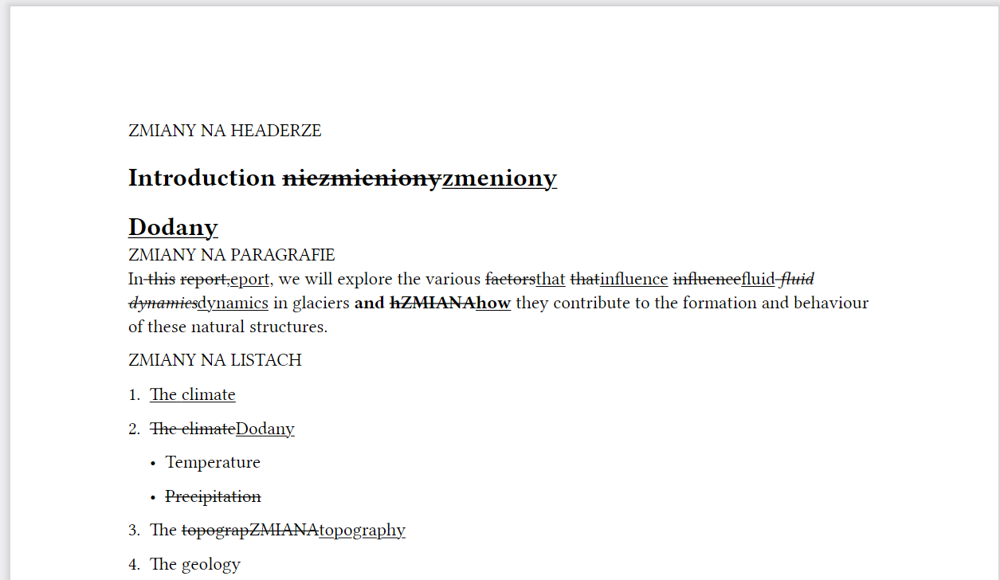
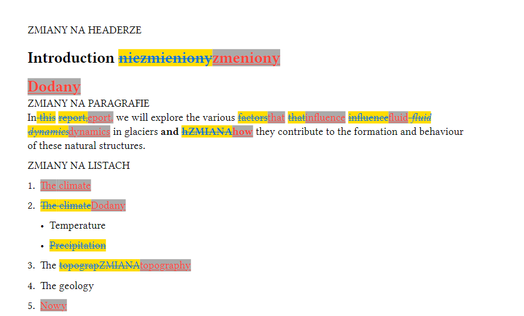

# User Guide

## Installation of Typstdiff package

In order to use Typstdiff package functionality You are required to install the package through `pip` package manager.
In order to do that in terminal You need to run the command:

```pip install typstdiff```

And that's it! If the installation goes succesfully You have the Typstdiff tool installed.

## How to use Typstdiff?

1. In order to use Typstdiff tool **locate and navigate to** the directory with the **.typst** extension files, on which You want to run Typstdiff. 
2. While in the directory open the **terminal**. Here You will be able to type the command that runs the Typstdiff program.
3. While in terminal **type** the command:

&nbsp;&nbsp;&nbsp;&nbsp;&nbsp;&nbsp;&nbsp;```typstdiff <path-to-old-file> <path-to-new-file> <path-to-output-typstdiff-file>```. 

&nbsp;&nbsp;&nbsp;&nbsp;&nbsp;&nbsp;&nbsp;This is the default command that runs the program, where:

&nbsp;&nbsp;&nbsp;&nbsp;&nbsp;&nbsp;&nbsp;&nbsp; - _typstdiff_: the name of the program

&nbsp;&nbsp;&nbsp;&nbsp;&nbsp;&nbsp;&nbsp;&nbsp; - _path-to-old-file_: full name (with the .typst extension) of the _.typst_ file, located in the given directory, which is **the old version** of our file. To that file we will be comparing our new version of the file and - in accordance with the differences the output file will be then formatted.

&nbsp;&nbsp;&nbsp;&nbsp;&nbsp;&nbsp;&nbsp;&nbsp; - _path-to-new-file_: full name (with the .typst extension) of the _.typst_ file, located as well in the given directory, which is **the new version** of our file. This typst document will be compared to the old version.

&nbsp;&nbsp;&nbsp;&nbsp;&nbsp;&nbsp;&nbsp;&nbsp; - _path-to-output-typstdiff-file_: full name (with the .typst extension) of the _.typst_ file, where we want to save the result of the Typstdiff tool evaluation. It is **the output file** of the tool. This document will contain the original, old version of the analysed document with all the differences (deletions, additions, upgrades) that the new version of the analysed document has. No information from both of the files will be lost (only if the file contains supported by Typstdiff tool types). 

**Example:**

```typstdiff old.typ new.typ typstdiff_compared.typ```

Now all the differences will be marked with the default configurations:



The _deletions_ are **striked out**, the _insertions_ are **underlined**. The _updates_ show two versions - what was written before (striked out) and what the new file contains now (underlined).

### Advanced options - customization
4. Additionally, there is an option for You to customize how the deletions and insertions are marked.
You can add (and choose a colour of) the highlight to Your changes - separately for inserts and deletions, as well as change the colour of the font. To do that, the Typstdiff needs to be run with the command:

```typstdiff [ADDITIONAL-OPTIONS] <path-to-old-file> <path-to-new-file> <path-to-output-typstdiff-file>```

The options include:

- `-ih`, `--insert-highlight` - which sets custom highlight to inserted changes

- `if`, `--insert-font` - which sets custom font to inserted changes 

- `-dh`, `--delete-highlight` - which sets custom highlight to deleted changes

- `df`, `--delete-font` - which sets custom font to deleted changes


After providing the given option flag You need to specify the colour from the Typst predefined colours:


| Shortcut | Colour Name | RGB Code  | **Typst Colour** |
|----------|-------------|-----------|------------------|
| bl       | black       | luma0     | **black**        |
| ga       | gray        | luma170   | **gray**         |
| si       | silver      | luma221   | **silver**       |
| wh       | white       | luma255   | **white**        |
| na       | navy        | #001f3f   | **navy**         |
| bu       | blue        | #0074d9   | **blue**         |
| aq       | aqua        | #7fdbff   | **aqua**         |
| te       | teal        | #39cccc   | **teal**         |
| ea       | eastern     | #239dad   | **eastern**      |
| pu       | purple      | #b10dc9   | **purple**       |
| fu       | fuchsia     | #f012be   | **fuchsia**      |
| ma       | maroon      | #85144b   | **maroon**       |
| re       | red         | #ff4136   | **red**          |
| or       | orange      | #ff851b   | **orange**       |
| ye       | yellow      | #ffdc00   | **yellow**       |
| ol       | olive       | #3d9970   | **olive**        |
| gr       | green       | #2ecc40   | **green**        |
| li       | lime        | #01ff70   | **lime**         |

Aside from the given colours You can simply provide the RGB code of the desired colour.

Here is the output of the Typstdiff parsing, with the user's customizations:

**Example**


```typstdiff old.typ new.typ typstdiff_compared.typ -if red -df blue -ih gray -dh yellow```

